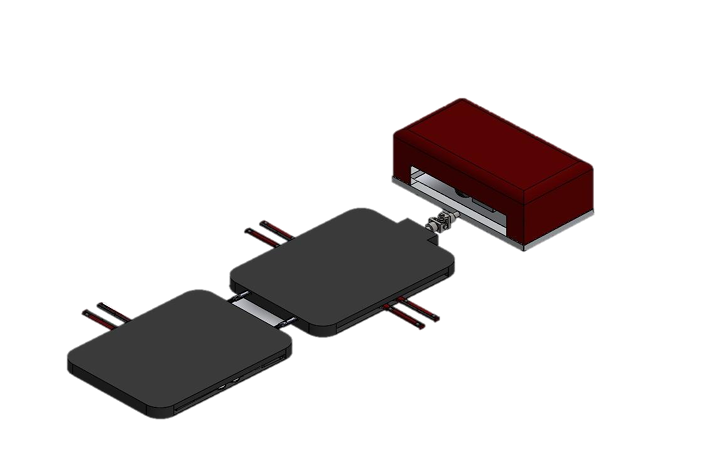

# Guidance Robot

**Description:**  
A guidance robot designed and modeled in SolidWorks, which was **produced in real life**. Demonstrates mechanical design, assembly, and functional implementation.

**Features:**  
- Full 3D model including motors, sensors, and tablet mount  
- Beam-supported structure for stability. 
- Inclined surface for tablet and camera placement  
- Hollow interior for components  

**Photos:**  
**SolidWorks Models:**  
  
  

**Produced Robot:**  

**Drawings:**  
Technical drawing sheets are included in the [Drawings folder](Robot/Guidance%20Robot%20Drawing%20Sheets).

# Parking Robot

**Description:**  
A prototype parking robot fully designed in SolidWorks. Demonstrates mechanical design, simulation, and interaction with a car for testing.

**Features:**  
- Two main plates, each with two handles to lift car wheels  
- Handles open and close using a gear mechanism  
- Plates move on wheels for positioning  
- Linear actuators adjust the plate length to match the car size  
- Complete assembly and motion simulation  
- Technical drawings included for reference  

**Photos:**  
**SolidWorks Models:**  
  
  

**Additional Views:**  
  

**Drawings:**  
Technical drawing sheets are included in the `Parking Robot Drawing Sheets` folder inside the project folder.
